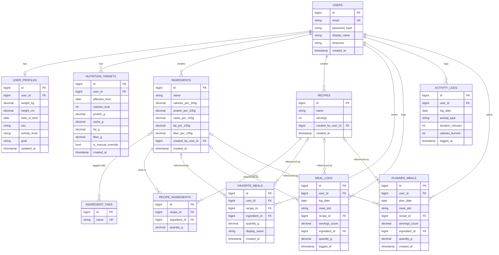

# Database Design

Status: **draft** — first pass derived from [`business-description.md`](business-description.md).
Items marked *(Proposed)* are default choices, not yet confirmed.

Engine: **PostgreSQL** (per [`architecture.md`](architecture.md)). Primary keys are
**`bigint identity`** *(Decided)* — simpler and smaller than GUIDs. Trade-off accepted
knowingly: sequential IDs are enumerable via the API (e.g. `/api/recipes/124` implies
`125` likely exists), so per-user authorization checks at the `Food.Api` layer must be
solid everywhere a resource is fetched by ID — there's no ID-obscurity safety net here.

## Entity-relationship diagram

## Table notes

- **users / user_profiles** — split in two because auth identity (email, password) and
  physical profile data (weight, height...) change at different rates and for different
  reasons. `password_hash` is nullable for SSO-only accounts. `timezone` on `users`
  drives the "day boundary" rule from the business doc.
- **nutrition_targets** — a **history table**, not a single mutable row: each row is
  valid `effective_from` a date until superseded. The target for a given day = the most
  recent row where `effective_from <= that day`. This is what lets past dashboard days
  show the target that actually applied then, even after the user's profile changes
  later. `is_manual_override` distinguishes a system-calculated row from a user-typed one.
- **ingredients** — global, shared by all users (per business doc); `created_by_user_id`
  is kept for attribution/auditing, not for scoping visibility.
- **ingredient_tags** / the ingredient↔tag relationship — modeled as many-to-many; the
  diagram shows it directly, the real schema has a join table
  (`ingredient_ingredient_tags`) with no extra columns.
- **recipe_ingredients** — the join table that gives a recipe its composition; this is
  where "total macros" gets computed from (`ingredient.macros_per_100g × quantity_g`,
  summed, divided by `servings`).
- **favorite_meals** and **meal_logs** both point to *either* `recipe_id` *or*
  `ingredient_id`, matching the business rule that a logged meal can be a raw ingredient
  or a recipe portion. A `CHECK` constraint enforces exactly one is set in both tables.
- **activity_logs** — `activity_type` is a free-text string for now, matching the
  decision to skip MET-formula calorie estimation initially. `calories_burned` is
  manually entered and is what adjusts that day's calorie target on the dashboard.
- **planned_meals** — mirrors `meal_logs`: points to *either* `recipe_id` *or*
  `ingredient_id` (enforced via `CHECK`, same as `meal_logs`/`favorite_meals`). This
  matters because the actual goal behind the planner isn't just "assign recipes to
  days" — it's pre-building a day's full nutrition (recipes *and* standalone
  ingredients) to check it hits the day's target *before* the week starts, the same way
  `meal_logs` lets you check it *after* you've eaten. That check (sum of planned macros
  vs. `nutrition_targets` for that date) is a read/query concern, not a new table.

## Deliberately not a table: the shopping list

The shopping list is **computed on demand**, not persisted: aggregate
`recipe_ingredients` (quantity × `planned_meals.servings_count`) for all `planned_meals`
in a selected date range, grouped by ingredient. No `shopping_list_items` table exists.

This is a deliberate simplicity choice: introducing a stored, editable shopping list
means solving a different problem (e.g. a "purchased" checkbox needs to survive the plan
changing underneath it). If check-off/persistence turns out to be needed, that's a
follow-up schema change, not something to build speculatively now.

## Open questions

- [ ] Should `ingredient_tags` be a fixed/seeded list or fully user-extensible?
- [ ] Does `favorite_meals` need its own `display_name`, or always derive the name from
      the linked recipe/ingredient?
- [ ] Retention/editability rules for past `meal_logs`/`activity_logs` (e.g. can a user
      edit a log from 3 months ago?) — not yet discussed.
